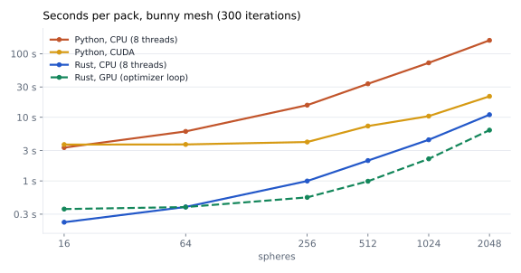
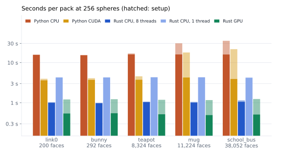

# MorphIt-rs

Rust port of [MorphIt](https://github.com/HIRO-group/MorphIt-1)
([paper](https://arxiv.org/abs/2507.14061)): approximate a triangle mesh with a
fixed budget of spheres by gradient-based optimization. The port ships as

- **`morphit`**: a Rust library crate with the complete optimizer,
- **`morphit-capi`**: a thread-safe C library (`morphit_capi.dll` / `.so` /
  `.dylib` plus a static library) with a generated header, `include/morphit.h`,
- **`morphit-cli`**: a `morphit` command-line tool,
- **`morphit-server`**: an HTTP server compatible with the Python web service,
  with its web UI, and a Docker image ([HTTP API](#http-api), [Docker](#docker)),
- **`morphit-robot`**: object URDF generation and the robot pipeline (URDF
  inspection, per-link packing, spherical URDF assembly) behind the server,
- **`morphit-wasm`**: the library compiled to WebAssembly with a
  JavaScript/TypeScript API, WebGPU included ([WebAssembly](#webassembly)),
- **`morphit-studio`**: an interactive app (Bevy, egui) for meshes and robots
  that runs on the desktop and in the browser ([MorphIt Studio](#morphit-studio)).

It reproduces the Python optimizer: voxel-grid initialization, the eleven
weighted losses (coverage, overlap, boundary, surface, containment, SQEM, soft
Hausdorff, mesh containment, mass, center of mass, inertia), Adam with gradient
clipping, count-preserving annealed density control, escaped-center projection
and the final prune. The presets MorphIt-V, -S, -B, -Obj and -Obj-mass are
included, and results use the same JSON schema, so the Python URDF/MJCF scripts
and the web viewer can read them.

Gradients are derived by hand (no ML framework) and checked against finite
differences and against PyTorch autograd. The optimizer runs on the CPU with
rayon; the distance searches, which are all of the cost, can run on any GPU
through wgpu. A seed makes a run bit-for-bit reproducible regardless of the
thread count *and* of the device (see [GPU](#gpu)).

## Build

```sh
cargo build --release            # library, C library and CLI
cargo test --workspace --all-features
cargo build --release --no-default-features   # without the GPU backend and mesh union
```

The default features are `gpu` (wgpu backend, see [GPU](#gpu)), `union`
(boolean union for [mesh preparation](#input-mesh-requirements)) and
`parallel` (rayon; without it every loop runs in order on the calling thread
with identical results, as in the browser build); each can be dropped
individually. `cargo build`/`cargo test` without `-p` skip the Bevy app
(`default-members`); `cargo t` runs every suite except it, and
`cargo build -p morphit-studio` builds it.

Outputs land in `target/release`: `morphit(.exe)`, `morphit_capi.dll` +
`morphit_capi.dll.lib` (Windows) or `libmorphit_capi.so` / `.dylib`, and the
static `morphit_capi.lib` / `libmorphit_capi.a`. The header
`crates/morphit-capi/include/morphit.h` is regenerated by cbindgen on every
build and checked in.

## Command line

```sh
morphit pack link0.obj --preset MorphIt-B --spheres 20 --iterations 300 --seed 42 -o spheres.json
morphit pack bunny.stl -p MorphIt-V -n 64 --set training.center_lr=0.001 --history log.json
morphit metrics link0.obj spheres.json          # debug_quick_eval-style quality metrics
morphit info link0.obj                          # volume, bounds, inertia, bodies, ...
morphit prepare parts.obj -o parts_prepared.stl   # the mesh as packing prepares it (--convex-hull, --no-union)
morphit export spheres.json -o link0.urdf         # URDF (ROS, PyBullet, Genesis, ...)
morphit export spheres.json -o link0.xml --anchored   # MJCF for MuJoCo, welded to the world
morphit presets
morphit devices                                 # GPU adapters for --device gpu:N
morphit pack big.obj -n 2000 --device gpu       # force the GPU (default: auto)
```

Progress goes to stderr; without `-o` the result JSON is written to stdout.
`export` writes the packed spheres as a simulator model, as the Python
`create_object_urdf.py` does: URDF (one link per sphere on fixed joints) or
MJCF (a MuJoCo body per sphere, mass from the geom density). The total mass
(`--total-mass`, default 1 kg) is split by sphere volume, and the object
floats freely unless `--anchored`. The format follows the output extension
(`.xml` is MJCF) or `--format`.
`--set KEY=VALUE` accepts any dotted config key (`model.*`, `training.*`,
`random_seed`); `--config file.json` loads a (partial) nested config first.
`metrics` scores the prepared mesh, the one packing used; `--raw-mesh` scores
the file as loaded, as `debug_quick_eval.py` does.

## Input mesh requirements

MorphIt decides what is inside the mesh with a ray-parity test, which needs a
closed surface. CAD exports that contain several overlapping solids, such as a
body and a fitting exported as separate parts into one file, read as hollow
where the solids overlap, and spheres get pushed out of that region.

On load, overlapping closed bodies are detected and replaced with their boolean
union, as in the Python code. Meshes with a single body, or with bodies that do
not overlap, are used as-is. Open (non-watertight) bodies cannot be unioned; a
warning is logged and the raw mesh is packed, so export such parts as a single
solid. What was done is recorded under `mesh_prep` in the result JSON. Set
`model.union_overlapping_bodies = false` to disable the step. Note that an inner
shell wound inward (a cavity) counts as a body too and gets filled, as in Python.

`model.convex_hull = true` (off by default, not in Python) replaces every body
with its convex hull before that step, for collision models where
concavities, holes and thin gaps do not matter: the spheres then approximate a
simpler, closed shape. Open bodies become closed hulls, and hulls that overlap
are merged when `union_overlapping_bodies` is on; with it off the hulls are
packed side by side. The report then says `hulled` (or `unioned` with
`convex_hull: true`) and counts the hulls in `n_hulled`;
`morphit info mesh.obj --convex-hull` shows what it would do, and
`morphit prepare mesh.obj --convex-hull -o hull.obj` writes the prepared mesh
(OBJ with exact coordinates, or binary STL); the HTTP API, the C API, the
wasm build and the studio export it too.

The union uses [manifold-rust](https://crates.io/crates/manifold-rust), a
pure-Rust port of the Manifold library that Python calls through manifold3d.
On the parity cases in `tests/fixtures/mesh_prep/` both produce the same
decisions, warnings, face counts and volumes. On two overlapping boxes packed
with MorphIt-S (20 spheres, 200 iterations) the union keeps all 20 spheres;
the raw mesh loses 16 of them to the final prune.

## Rust

```rust
use std::{ops::ControlFlow, sync::Arc};
use morphit::{Config, Mesh, Preset, Session};

let mesh = Arc::new(Mesh::load("link0.obj")?);
let mut config = Config::from_preset(Preset::B);
config.model.num_spheres = 20;
config.random_seed = Some(42);

// One call ...
let result = morphit::pack(config.clone(), mesh.clone())?;

// ... or step by step.
let mut session = Session::new(config, mesh)?;
session.run(|step| {
    println!("{} {}", step.iteration, step.total_loss);
    ControlFlow::Continue(())
})?;
session.finalize();
session.result().save("spheres.json")?;
```

## C

```c
#include "morphit.h"

morphit_mesh *mesh; morphit_config *cfg; morphit_session *s;
morphit_mesh_load("link0.obj", &mesh);
morphit_config_new("MorphIt-B", &cfg);
morphit_config_set_i64(cfg, "model.num_spheres", 20);
morphit_config_set_i64(cfg, "random_seed", 42);
morphit_session_new(mesh, cfg, &s);
morphit_mesh_free(mesh);             /* the session keeps what it needs */
morphit_config_free(cfg);

morphit_run(s, on_progress, NULL);   /* all iterations, then finalize */

size_t n;
morphit_get_spheres(s, NULL, NULL, NULL, 0, &n);           /* size query */
morphit_get_spheres(s, centers, radii, NULL, n, &n);       /* consistent copy */
morphit_result_save(s, "spheres.json");
morphit_session_free(s);
```

Every function returns a `morphit_status`; on failure `morphit_last_error()`
describes the problem (per thread). Array and string outputs take a buffer and
its capacity; `NULL` with capacity 0 asks for the size.
`morphit_config_set_str(cfg, "model.device", "gpu")` selects the device;
`morphit_device_count`/`morphit_device_name` list adapters and
`morphit_session_device` reports what a session runs on.
`morphit_session_mesh_prep_json` returns the mesh preparation report; the
union is computed once per mesh handle and shared by its sessions.
`morphit_mesh_prepare(mesh, union, hull, &prepared)` returns the prepared mesh
as a new handle, `morphit_mesh_prep_report_json` what was done, and
`morphit_mesh_save(mesh, "out.obj")` writes any mesh as .obj or .stl.

**Threading.** Every function may be called from any thread.

- Meshes are immutable and can be shared by any number of sessions.
- Configs lock internally.
- Independent sessions run fully in parallel.
- Within one session, the read functions (`morphit_state`, `morphit_get_*`,
  `morphit_result_*`) and `morphit_cancel` may be called while `morphit_run` is
  active on another thread. Readers see a snapshot published after every
  iteration and never wait for one.
- Mutating calls (`morphit_step`, `morphit_run`, `morphit_finalize`,
  `morphit_session_free`) return `MORPHIT_ERR_BUSY` during a run instead of
  blocking. This also applies from inside the run's own progress callback,
  which is called with no locks held.
- Panics never cross the boundary; they become `MORPHIT_ERR_PANIC`.
- `morphit_set_num_threads` sizes the worker pool before first use.
- `morphit_set_log_callback` forwards the library's log messages. Nothing is
  printed otherwise.

`crates/morphit-capi/examples/c` contains `pack.c`, `threads.c` (four
concurrent sessions, polling and cancelling a live run) and a CMake project.
With MSVC:

```bat
cargo build --release -p morphit-capi
cl /W4 /MD /I crates\morphit-capi\include crates\morphit-capi\examples\c\threads.c ^
   /link target\release\morphit_capi.dll.lib
```

### Using the release package from CMake

Each [release](https://github.com/KevinGliewe/MorphIt-rs/releases) has a
`morphit-capi-<version>-<target>` archive for Windows x64, Linux x64/arm64
and macOS arm64/x64:

```
include/morphit.h
bin/morphit_capi.dll                        (Windows)
lib/morphit_capi.dll.lib, morphit_capi.lib  (Windows: import and static library)
lib/libmorphit_capi.so | .dylib, lib/libmorphit_capi.a
lib/cmake/morphit/morphit-config.cmake      (+ version file, system libraries of the static library)
```

Unpack it anywhere and point `CMAKE_PREFIX_PATH` at the folder:

```cmake
find_package(morphit 0.1 CONFIG REQUIRED)
target_link_libraries(app PRIVATE morphit::morphit)           # shared library
# target_link_libraries(app PRIVATE morphit::morphit_static)  # static, with its system libraries
```

```sh
cmake -S . -B build -DCMAKE_PREFIX_PATH=/path/to/morphit-capi-0.1.0-x86_64-unknown-linux-gnu
```

On Windows copy `morphit_capi.dll` next to the executable
(`$<TARGET_RUNTIME_DLLS:app>` lists it); the static library there is built
against the DLL runtime (`/MD`). A `0.1` request accepts any `0.1.x`. The
examples in `crates/morphit-capi/examples/c` use the package when
`CMAKE_PREFIX_PATH` points at one (`-DMORPHIT_STATIC=ON` for the static
library), and `tools/ci/test_capi_package.sh <archive>` builds and runs them
against an archive, as the release workflow does on every platform it can
run.

## GPU

`model.device` (CLI `--device`) is `auto` by default: a GPU is used when one is
present and the problem is large enough (`spheres × samples ≥ 4·10^6`, e.g.
400 spheres at the default 5000 + 5000 samples); `cpu` and `gpu`/`gpu:N` force
a device. Python's `cuda`, `cuda:N` and `mps` are accepted as aliases. wgpu runs
on Vulkan, DirectX 12 and Metal, so NVIDIA, AMD, Intel and Apple GPUs all work
and nothing needs to be installed.

**Results do not depend on the device.** The GPU kernels run in f32 and only
propose, for every sample, which sphere is nearest and by what margin (and the
candidate pairs of the boundary loss). The CPU recomputes every chosen pair in
f64 with the same code as the CPU backend and rescans the rare rows whose f32
margin is below a proven error bound. The loss and gradient code never sees
which backend ran, so `--device gpu` and `--device cpu` write byte-identical
files, the Python parity fixtures pass on both, and a GPU error simply moves the
session back to the CPU (with a warning). Software rasterizers (DX12 WARP,
lavapipe) are only used when named explicitly or with
`MORPHIT_GPU_ALLOW_SOFTWARE=1`.

Milliseconds per iteration on link0 (RTX A2000 Laptop GPU vs 16 CPU threads):

| spheres | samples | B cpu | B gpu | Obj cpu | Obj gpu |
|---|---|---|---|---|---|
| 64 | 5 000 | 1.3 | 1.1 | 1.1 | 1.1 |
| 256 | 5 000 | 3.0 | 3.1 | 3.2 | 2.1 |
| 1024 | 5 000 | 12.3 | 7.5 | 12.1 | 6.8 |
| 64 | 50 000 | 8.3 | 5.3 | 7.4 | 7.1 |
| 256 | 50 000 | 20.2 | 6.9 | 18.8 | 7.9 |
| 1024 | 50 000 | 89.3 | 13.6 | 63.7 | 16.9 |

Concurrent sessions share one GPU context per adapter and submit independently.
The error bound behind the guarantee is derived in
`crates/morphit/src/search/gpu/session.rs`.

In the browser the same kernels run on WebGPU. A readback there completes only
after control returns to the browser, so the optimizer step is written as
`async` (`Session::step_async`); natively its future completes immediately and
`Session::step` stays synchronous. GPU sessions in the browser are checked to
be bit-identical to CPU sessions (`crates/morphit-wasm/tests/browser.rs`).

## HTTP API

`morphit-server` serves the web UI and the HTTP API of the Python version
(`web/api/main.py`): the same routes, form fields, JSON keys, headers and
status codes, so the bundled page (`web/index.html`, copied from the Python
repository together with its example library in `web/examples`) runs against
it unchanged.

```sh
cargo run --release -p morphit-server              # http://localhost:8000
cargo run --release -p morphit-server -- --bind 127.0.0.1:9000 --device cpu
```

| Flag | Environment | Default |
|---|---|---|
| `--bind` | `MORPHIT_BIND` | `0.0.0.0:8000` |
| `--web-dir` | `MORPHIT_WEB_DIR` | `web` next to the binary, else `./web` |
| `--device` | `MORPHIT_DEVICE` | `auto` |
| `--threads` | `MORPHIT_THREADS` | all cores |
| `--session-dir` | `MORPHIT_SESSION_DIR` | `<temp>/morphit-robot-sessions` |
| `--session-ttl` | `MORPHIT_SESSION_TTL` | `3600` seconds |
| `--log` | `MORPHIT_LOG` | `info` |

`morphit-server --healthcheck` requests `/healthz` on the bind address and
exits 0 when it answers, which is what the Docker health check runs.

| Route | Purpose |
|---|---|
| `GET /`, `GET /healthz` | web UI, `{"ok":true}` |
| `GET /api/examples`, `GET /api/example/{name}[/packed\|/thumbnail]` | example objects, mesh, pre-baked URDF (`X-Morphit-Centroid`), PNG |
| `POST /api/morph` | form: `mesh` (.obj/.stl/.ply), `variant`, `num_spheres` (1–200), `iterations` (1–1000), `seed`, `advanced` (JSON), `base_color`, `union_overlapping_bodies` and `convex_hull` (mesh preparation, defaults `true` and `false`). Returns the object URDF with `X-Morphit-Centroid`, `X-Morphit-Loss` and `X-Morphit-Mesh-Prep` |
| `POST /api/morph/analyze` | form: `mesh`, `urdf`, `union_overlapping_bodies` (default `true`), `convex_hull` (default `false`); score against the mesh the packing used. Surface distances and coverage |
| `GET /api/robot/examples`, `POST /api/robot/example/{name}`, `GET /api/robot/example/{name}/spherical` | example robots; loading one opens a session |
| `POST /api/robot/inspect` | form: repeated `files` (names are package paths), optional `urdf`. Opens a session and classifies the collisions |
| `GET /api/robot/file?session_id=&path=` | files of the session (`package://`, relative) |
| `GET /api/robot/mesh-stats?session_id=` | area and volume per packed collision |
| `POST /api/robot/pack-link` | form: `session_id`, `link_name`, `collision_index`, plus the `/api/morph` options |
| `GET /api/robot/pack-live?session_id=` | websocket with the live spheres of the running pack |
| `POST /api/robot/assemble` | form: `session_id`, `base_color`, `color_variation`. The spherical URDF |
| `POST /api/robot/analyze` | form: `session_id`. Metrics per packed link, each against the mesh it was packed on |
| `POST /api/mesh/prepare` | form: `mesh`, `union_overlapping_bodies` (default `true`), `convex_hull` (default `false`), `format` (`obj` default, or `stl`). The prepared mesh as a download, with the report in `X-Morphit-Mesh-Prep` |
| `GET /api/robot/prepared-mesh?session_id=&link_name=&collision_index=` | the prepared mesh of one collision of a robot session; same `union_overlapping_bodies`, `convex_hull` and `format` options as query parameters |

`union_overlapping_bodies` and `convex_hull` are additions to the Python API
(which always merges and never builds hulls): `union_overlapping_bodies=false`
packs the mesh exactly as loaded (the `X-Morphit-Mesh-Prep` report then says
`disabled`), and `convex_hull=true` packs the convex hull of each body. The
web UI has both under Advanced settings, Mesh preparation.

Robot sessions live in the server's memory and in the session directory, and
expire after the TTL. Run a single instance. Uploads are capped at 100 MB per
object mesh and 200 MB per robot package (50 MB per file), as in Python.

The URDF generation, robot inspection, per-link packing and URDF rewrite live
in the `morphit-robot` crate, usable without the server.

Differences from the Python service:

- `/docs` and `/openapi.json` (FastAPI's generated docs) are not served.
- 422 responses have FastAPI's `detail` list shape for missing and
  unparsable fields, not every pydantic error type.
- A negative `seed` is rejected with 400.
- An unreadable upload is a 400 with the parser's message; mesh files that
  enclose no volume are rejected, where trimesh would load them.
- The assembled robot URDF keeps the original text (comments, formatting) and
  only edits it; Python re-serializes it through ElementTree. The elements,
  names, colors and joint origins are the same.
- `device` defaults to `auto` (GPU for large problems) instead of CUDA-or-CPU.

## Docker

The `Dockerfile` builds the server in a Rust image and copies the binary and
`web/` into a small runtime image (non-root user `morphit`, port 8000, health
check on `/healthz`).

```sh
docker build -t morphit-server .                     # CPU image (default target)
docker run --rm -p 8000:8000 morphit-server

docker build --target runtime-gpu -t morphit-server:gpu .
docker run --rm --gpus all -p 8000:8000 morphit-server:gpu

docker compose up                                    # CPU, port 8000
docker compose --profile gpu up morphit-gpu          # GPU, port 8001
```

Configure the server with the `MORPHIT_*` variables above. The CPU image has
no Vulkan loader, so `auto` packs on the CPU. The GPU image adds the Vulkan
loader and the NVIDIA driver manifest and needs a Linux host with the NVIDIA
driver and the NVIDIA Container Toolkit. Docker Desktop on Windows (WSL 2)
passes NVIDIA GPUs through for CUDA only, not Vulkan, so there the GPU image
runs on the CPU. The server log lists the GPUs it found at startup. Results
are identical either way.

Behind a proxy that re-signs TLS, give the build its CA chain as a secret:

```sh
docker build --secret id=ca_certs,src=corp-ca.pem -t morphit-server .
```

## WebAssembly

`crates/morphit-wasm` compiles the optimizer, the object URDF/MJCF writers, the
quality metrics and the robot pipeline to WebAssembly, with a JavaScript API
modelled on the C API and TypeScript declarations:

```sh
cargo build -p morphit-wasm --target wasm32-unknown-unknown --profile wasm-release
wasm-bindgen --target web --out-dir pkg target/wasm32-unknown-unknown/wasm-release/morphit_wasm.wasm
# or: wasm-pack build crates/morphit-wasm --target web
```

```js
import init, { Config, Mesh, Session, initGpu, objectUrdf } from "./pkg/morphit_wasm.js";
await init();
await initGpu();                               // optional: WebGPU for the searches
const mesh = Mesh.fromBytes(bytes, "obj", "bunny.obj");
const config = Config.fromPreset("MorphIt-B");
config.set("model.num_spheres", 20);
const session = new Session(config, mesh);
while (!session.isDone) {
  await session.stepMany({ budgetMs: 12 });    // then yield, so the page stays responsive
  draw(session.centers(), session.radii());
}
session.finalize();
const urdf = objectUrdf(session.centers(), session.radii(), { name: "bunny" }).text;
```

- **Objects:** `Mesh` (`fromBytes` for OBJ/STL/PLY/DAE, `fromArrays`, `info`,
  `prepared`/`prepReport` with `{ unionOverlappingBodies, convexHull }`,
  `toObj`/`toStl`),
  `Config` (presets, dotted keys), `Session` (`step`, `stepMany`, `stepSync` on
  the CPU, `centers`/`radii`/`masses`, `finalize`, `resultJson`,
  `historyJson`), `objectUrdf`/`objectMjcf`, `evaluatePacking`.
- **Robots:** `RobotPackage` (`fromFiles`, `fromZip`, `addFile`, `inspect`,
  `linkPoses`, `packLink` returns a `Session`, `setLinkResult`, `assemble`),
  plus `linkQuality`/`aggregateOverall`. Inspection and assembly give the same
  reports and byte-identical URDFs as the server
  (`crates/morphit-robot/tests/vfs_parity.rs`).
- **Threads:** everything runs on the calling thread. `stepMany` bounds the
  work per call; `Session::new` (sampling, mesh union) and the metrics run in
  one piece.
- **Results across platforms:** a browser run is reproducible with a seed and
  identical on the CPU and WebGPU, but may differ in the last bits from a
  native run, because WebAssembly uses its own `exp`/`ln`/`sin`.

`crates/morphit-wasm/www` is a small example page (pick a mesh, pack it, watch
it, download the result). Tests: `cargo test -p morphit-wasm --target
wasm32-unknown-unknown` runs the API tests in Node.js (it needs
`wasm-bindgen-cli` 0.2.128, the version in `Cargo.lock`); the WebGPU test runs
in a browser with `NO_HEADLESS=1 cargo test -p morphit-wasm --target
wasm32-unknown-unknown --test browser` and opening the printed address.

## MorphIt Studio

`apps/morphit-studio` is an interactive app built with Bevy 0.18, egui and
[bevy_editor_cam](https://github.com/aevyrie/bevy_editor_cam). It runs natively
and in the browser from the same code:

- **Object mode:** open a mesh (dialog, drag and drop, or one of the 20
  bundled examples), choose preset, sphere count, iterations, seed, device,
  mesh preparation (merge overlapping bodies, on by default; convex hull of
  each body, off by default) and the advanced
  loss weights, and watch the spheres and the loss curve while it
  packs (pause, finish early, cancel). Save the result JSON, a URDF or MJCF
  (free or anchored, with a total mass), and analyze coverage, surface
  distance and mass properties. "prepared mesh" draws the mesh as packing
  prepares it with the current settings, and "Save prepared mesh" exports
  it as OBJ or STL (in robot mode, the selected collision).
- **Robot mode:** open a robot package (a folder, a `.zip` or one of the 10
  bundled robots). The collision meshes appear at their zero-configuration
  poses; pack all of them or a selected one, assemble the spherical URDF
  (colors spread over the links) and save it, save each link's sphere JSON,
  and analyze every link.
- **Camera:** right drag orbits, left drag pans, the wheel zooms, all about
  the point under the cursor (bevy_editor_cam). The panels keep their input.

```sh
cargo run -p morphit-studio --release                    # desktop
cargo run -p morphit-studio --release -- --example kinova --pack
```

`--example NAME` opens a bundled object or robot (`bunny`, `kinova`, `ur5`,
...), `--open PATH` a mesh, `.zip`, `.urdf` or package folder, and `--pack`
starts packing once it is loaded. The desktop build packs on its own thread
with rayon and the GPU searches of the native build.

For the browser, build with [Trunk](https://trunkrs.dev) (the page and the
example library land in `target/studio-dist`) or with the script, which only
needs `wasm-bindgen-cli`:

```sh
trunk serve apps/morphit-studio/index.html               # http://127.0.0.1:8080
trunk build --release apps/morphit-studio/index.html
tools/build_studio_web.sh && python -m http.server 8080 --directory target/studio-dist
```

In the browser the query `?example=kinova&pack` does what the command line
options do. Packing runs on the page's thread in slices of about 10 ms between
frames. The searches use WebGPU when the browser has it, while Bevy draws
with WebGL2 (the `webgpu` feature switches its renderer to WebGPU too).
Folders are opened with the browser's folder picker, and saves become
downloads. The `dev` feature links Bevy dynamically for faster desktop
rebuilds.

## Validation against the Python implementation

- **Unit tests** cover every module. Each loss gradient is checked against
  central finite differences, for every preset and both mass modes. The GPU
  backend is checked for bit-equality with the CPU on random problems, exact
  and near ties, odd scales, and on the Python fixtures below (every loss, five
  training steps, a density-control pass), plus four concurrent GPU sessions
  through the C API.
- **Deterministic parity** (`crates/morphit/tests/python_parity.rs`) uses
  fixtures dumped from the Python code with all tensors in float64:

  | Check | Agreement |
  |---|---|
  | Mass properties vs trimesh | 1e-9 |
  | Containment vs the Cython test and trimesh | identical |
  | Every loss value and raw gradient vs PyTorch autograd | 1e-8 |
  | 5-step training trajectory | 1e-8 |
  | One density-control pass without warmup | 1e-12 |
  | Same pass with warmup | 1e-4 |

  The warmup tolerance is looser because reseeding makes a new sphere exactly
  tangent to a survivor. Whether that overlap term is active then depends on
  the last bit of `exp`/`log1p`, and Adam carries the difference forward.
- **Statistical comparison** reran the grid of
  the Python repo's `debug_quick_eval.py` with both implementations and scores
  both result sets with Python's own evaluator. The grid is link0, bunny and
  vase with V/S/B/Obj, 64 spheres and 300 iterations.
  - With seed 0, 9 of 12 rows fall within the sanity bands. The three
    outliers are all MorphIt-Obj, whose physics terms make results
    seed-sensitive.
  - Over five seeds (`--seeds 0,1,2,3,4 --variants morphit-obj`), all 21 Obj
    metric ranges overlap with Python's.
  - Rust has lower mass and inertia errors on link0 and is similar on the vase.
  - On the bunny, Rust's mean mass and inertia errors are about twice
    Python's (inertia 0.042 vs 0.017); the ranges overlap but Rust's reaches
    higher (0.061 vs 0.022). The mesh properties are
    identical, so this comes from the optimization path (float32 vs float64,
    random streams). It deserves a larger study if small-object physics
    fidelity matters.
  - For timings see [Performance](#performance).
- **Mesh preparation parity** (`crates/morphit/tests/mesh_prep_parity.rs`)
  compares Python's `prepare_mesh` and the Rust port on the same OBJ files:
  link0, OBJ groups with duplicated vertices,
  a degenerate sliver, disjoint bodies, an overlapping open body, two and
  three overlapping closed bodies, and an inward-wound inner shell. Every
  report field matches; unions agree in face and vertex count and to 1e-9 in
  volume.

- **Web service parity** (`crates/morphit-robot/tests/`): object URDF and
  MJCF models, free and anchored, equal Python's `create_object_urdf` output
  byte for byte, and exported MJCF files
  load in MuJoCo; inspection reports equal
  `discover.inspect_urdf` on all ten bundled robots; the rewritten robot URDF has the same sphere
  links, joint origins, colors and remaining collisions as `rewrite_urdf`.
  COLLADA meshes load with the same volume and
  bounds as trimesh (float32 precision), and every mesh in `web/examples`
  loads. `crates/morphit-server/tests/api.rs` drives every route, including
  the websocket, and the bundled UI was run in a browser against the server
  in both modes.

The `py_*.json` fixtures under `crates/*/tests/fixtures` were generated from
the Python reference implementation and are checked in, so the parity tests
run without Python; the scripts that produced them work against a local clone
of the Python repository and are not part of this repository.

## Performance

Wall time of one pack against the Python reference (PyTorch 2.7.1 on the CPU
with 8 threads, and on CUDA 12.6), with the same settings on both sides:
preset MorphIt-B, 300 iterations, 5000 inside and 5000 surface samples,
density control on, fixed learning rates, seed 0. Measured on one laptop
(Intel i7-11850H, 8 cores; NVIDIA RTX A2000 Laptop GPU, 4 GB). Python ran
once per case after an untimed warm-up; Rust is the median of three runs.

<picture>
  <source media="(prefers-color-scheme: dark)" srcset="assets/benchmark/scaling-dark.svg">
  
</picture>

<picture>
  <source media="(prefers-color-scheme: dark)" srcset="assets/benchmark/meshes-dark.svg">
  
</picture>

| Mesh (faces) | Spheres | Python CPU | Python CUDA | Rust, 8 threads | Rust, 1 thread | Rust, GPU | Speed-up |
|---|---:|---:|---:|---:|---:|---:|---:|
| link0 (200) | 16 | 3.24 | 3.57 | 0.21 | 0.48 | 0.98 | 15× |
| | 64 | 5.70 | 3.68 | 0.37 | 1.31 | 1.05 | 16× |
| | 256 | 15.88 | 3.96 | 1.03 | 4.30 | 1.21 | 15× |
| bunny (292) | 256 | 15.52 | 4.09 | 1.00 | 4.30 | 1.23 | 16× |
| | 1024 | 71.82 | 10.43 | 4.43 | | 2.22 ¹ | 16× |
| | 2048 | 162.10 | 21.37 | 10.98 | | 6.28 ¹ | 15× |
| teapot (8,324) | 256 | 16.93 | 4.57 | 1.07 | 4.35 | 1.19 | 16× |
| mug (11,224) | 256 | 30.29 | 17.87 | 1.06 | 4.35 | 1.17 | 29× |
| | 1024 | 122.02 | 58.88 | 4.19 | | 2.05 ¹ | 29× |
| school_bus (38,052) | 16 | 4.32 | 4.54 | 0.28 | 0.53 | 1.07 | 16× |
| | 256 | 34.94 | 21.63 | 1.15 | 4.29 | 1.24 | 30× |

Seconds per pack including mesh load and setup; the speed-up compares Python
on the CPU with Rust on 8 threads. Rust GPU times include about 0.65 s of
one-time device setup per process; ¹ optimizer loop only.

- The Rust CPU build is 15–30× faster than Python on the CPU, and still
  3.5–8× faster on a single thread. The optimizer loop costs about 1.3 ms per
  iteration at 64 spheres against about 20 ms in Python.
- Python's setup (sampling and initial spheres) runs on the CPU for both of
  its devices and grows with mesh size and sphere count, to 14–19 s for the
  large meshes at 256 spheres; Rust's stays under 0.1 s.
- CUDA speeds up Python's optimizer loop from about 64 spheres on, but its
  per-iteration overhead keeps a pack above 3.5 s. Rust's GPU loop is 7–9×
  faster than Python's CUDA loop at 256 spheres and overtakes the Rust CPU
  build from about 256 spheres; CPU and GPU give identical results.

## Differences from the Python code

- Mesh preparation can be switched off (`model.union_overlapping_bodies`) and
  extended with convex hulls (`model.convex_hull`); Python always merges and
  never builds hulls. Both keys are stored in the result's config.
- Float64 throughout. GPU support is a search accelerator with CPU-identical
  results rather than a float32 port; `model.device` therefore never changes
  the output.
- Random streams differ, so results are statistically, not bitwise, equal
  to Python's for the same seed.
- The flatness loss (weight 0 in every preset) is not implemented. A nonzero
  weight is rejected.
- Visualization and the robot pipeline's command-line scripts are not
  ported; their logic behind the web service is (see
  [HTTP API](#http-api)). Result files stay compatible with the Python scripts.
- Mesh input is OBJ, STL, PLY (ASCII and binary) and COLLADA (`.dae`, node
  transforms applied, units ignored as in trimesh). Meshes wound inward are
  flipped automatically.
- Voxel-grid initialization and `morphit_mesh_contains` use a rotated-ray
  containment test, the role `trimesh.contains` plays in Python. The optimizer
  itself uses an exact port of Python's Cython test.

## CI and releases

GitHub Actions (`.github/workflows`) build and test every push and pull
request, deploy the browser builds to GitHub Pages and cut releases:

- **CI** (`ci.yml`): rustfmt; clippy for the native workspace and for wasm32;
  `cargo t` on Linux, Windows and macOS, plus the sequential (no rayon) build
  and the studio's library tests on Linux; the GPU tests on Mesa's software
  Vulkan (lavapipe), so CPU = GPU bit identity is checked without a GPU; the
  wasm builds and the JavaScript API tests in Node and headless Chrome; and
  `cargo publish --dry-run` of every crate.
- **Pages** (`pages.yml`, pushes to `master`): MorphIt Studio at
  <https://kevingliewe.github.io/MorphIt-rs/> and the morphit-wasm example
  page at [`/wasm/`](https://kevingliewe.github.io/MorphIt-rs/wasm/), built by
  `tools/build_pages.sh` into `target/pages`.
- **Release** (`release.yml`, tags `v*` or started by hand): runs CI, then
  builds for Windows x64, Linux x64/arm64 and macOS arm64/x64 the archives
  `morphit-cli`, `morphit-studio` (with the example library),
  `morphit-server` (with `web/`) and `morphit-capi` (shared and static
  libraries, header and CMake package, see
  [Using the release package from CMake](#using-the-release-package-from-cmake)),
  plus `morphit-studio-web` and the `morphit-wasm` JS package, each with a
  `.sha256` (`tools/ci/package.sh`). A tag also creates the GitHub Release
  and publishes `morphit`, `morphit-robot`, `morphit-capi`, `morphit-cli` and
  `morphit-server` to crates.io (`tools/ci/publish_crates.sh`, which skips a
  version that is already published); a manual run publishes only when
  `publish-crates` is ticked.

To release, bump `version` in the root `Cargo.toml`, commit, then
`git tag v0.2.0 && git push origin v0.2.0`; the tag must match the version.
One-time repository setup: Settings > Pages > Source "GitHub Actions"; a
`CARGO_REGISTRY_TOKEN` secret (crates.io API token with publish rights) in an
environment named `crates-io` (add required reviewers there to approve each
publish). Once the crates exist, crates.io Trusted Publishing can replace the
token. `cargo install morphit-server` installs only the binary: point
`--web-dir`/`MORPHIT_WEB_DIR` at a copy of `web/`, or use the release archive,
which has it next to the executable.

### Running the workflows locally

`actionlint` checks the workflow files (and, with shellcheck installed, their
scripts). [act](https://github.com/nektos/act) runs the Linux jobs in Docker
through `tools/act.ps1`, which picks the runner image, an event file from
`tools/ci/events` (they set `"act": true`, so deployments, the GitHub Release
and the crates.io upload are skipped) and a local artifact store in
`target/act-artifacts`:

```powershell
tools/act.ps1 ci -Job fmt
tools/act.ps1 ci -Job test -Matrix os:ubuntu-latest
tools/act.ps1 ci -Job test-gpu
tools/act.ps1 pages -Job build
tools/act.ps1 release                        # manual release run: Linux x64 leg, web, crates as a dry run
tools/act.ps1 release -Event tag -DryRun     # job graph of a tag push
```

Windows and macOS jobs cannot run in act; `-DryRun` shows their plan and the
scripts behind them run directly (`tools/ci/package.sh`, `tools/build_pages.sh`,
`tools/ci/publish_crates.sh --dry-run --allow-dirty`). Behind a proxy that
re-signs TLS, set `MORPHIT_CA_PEM` to its CA chain (a PEM file outside the
repository); the containers then trust it.

## Layout

```
crates/morphit/        optimizer library (config, device, mesh, mesh_prep, contains, sampling,
                       search/, loss/, optim, density, trainer, quality, result)
crates/morphit-capi/   C API (src/), generated header (include/), C examples, FFI tests
crates/morphit-cli/    `morphit` binary
crates/morphit-robot/  object URDF/MJCF, robot inspection/packing/assembly, quality metrics
crates/morphit-server/ HTTP API (axum), integration tests
crates/morphit-wasm/   WebAssembly bindings (JS/TS API), Node and browser tests, www/ example page
apps/morphit-studio/   Bevy + egui app for desktop and browser (index.html, Trunk.toml)
web/                   web UI and example library (from the Python repository)
Dockerfile, docker-compose.yml, docker/
tools/                 build_studio_web.sh, build_pages.sh,
                       act.ps1 (local workflow runs), ci/ (release packaging and publishing)
.github/               CI, Pages and release workflows, shared setup action
```

## License

MIT, like the original MorphIt. See `LICENSE`.
